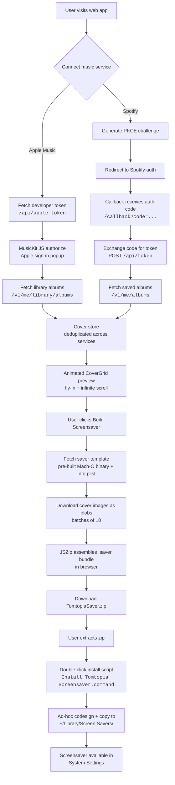

# Tomtopia Screensaver - Web Builder

A web app where users connect their music libraries, preview an animated album cover grid, and download a personalized macOS screensaver.

## How It Works



## Architecture

```mermaid
graph LR
    subgraph Browser
        UI[SvelteKit App<br/>SSR disabled]
        MK[MusicKit JS v3]
        SP[Spotify PKCE]
        ZIP[JSZip]
    end

    subgraph CF[Cloudflare Pages]
        API[/api/apple-token<br/>ES256 JWT via jose]
        STATIC[/saver-template/<br/>pre-built binary]
    end

    subgraph External
        AM[Apple Music API]
        SA[Spotify API]
    end

    UI --> API
    API -->|developer token| MK
    MK -->|user token| AM
    SP -->|access token| SA
    AM -->|artwork URLs| UI
    SA -->|artwork URLs| UI
    UI --> ZIP
    STATIC --> ZIP
    ZIP -->|.saver bundle| UI
```

## Project Structure

```
web/
├── src/
│   ├── routes/
│   │   ├── +page.svelte              Landing page + builder UI
│   │   ├── +page.ts                  SSR disabled
│   │   ├── callback/+page.svelte     Spotify OAuth callback
│   │   └── api/apple-token/          Server-side Apple Music JWT
│   └── lib/
│       ├── components/
│       │   ├── CoverGrid.svelte      Animated album grid (from tomtopia)
│       │   ├── CoverPreview.svelte   Grid with cover data or placeholder
│       │   ├── AppleMusicConnect.svelte
│       │   ├── SpotifyConnect.svelte
│       │   └── BuildDownload.svelte  Progress bar + download
│       ├── services/
│       │   ├── appleMusic.ts         MusicKit JS wrapper
│       │   ├── spotify.ts            OAuth PKCE + album fetch
│       │   └── bundleAssembler.ts    JSZip .saver assembly
│       └── stores/
│           └── covers.ts             Shared cover state + dedup
├── static/saver-template/            Pre-built binary (gitignored)
├── wrangler.toml
└── package.json
```

## Development

```bash
# Install dependencies
cd web && npm install

# Build saver template (from project root)
make saver-template

# Run dev server
npm run dev

# Deploy to Cloudflare Pages
npm run deploy
```

## Environment

| Variable | Where | Purpose |
|----------|-------|---------|
| `VITE_SPOTIFY_CLIENT_ID` | `web/.env` | Spotify app client ID (public) |
| `APPLE_TEAM_ID` | CF secret / `.dev.vars` | Apple Developer Team ID |
| `APPLE_KEY_ID` | CF secret / `.dev.vars` | MusicKit key ID |
| `APPLE_PRIVATE_KEY` | CF secret / `.dev.vars` | MusicKit .p8 private key |
